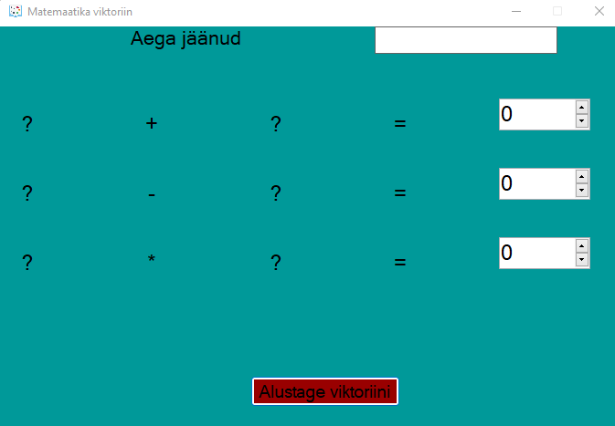
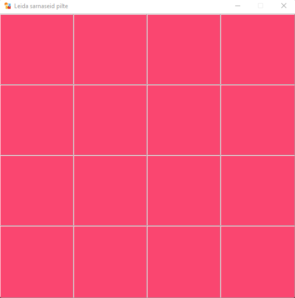

# Kirjeldus

Sellel programmil on kaks ainulaadset funktsiooni: Logi sisse, Registreeri ja Parooli taastamine.

## Logi sisse

Koodi näide:\
Funktsiooni:
```C#
public static void Append(string filename, string username, string password)
        {
            var username_ob = new XElement("User", new XElement("username", username), new XElement("password", password));

            var doc = new XDocument();

            if (File.Exists(filename))
            {
                doc = XDocument.Load(filename);
                doc.Element("Profile").Add(username_ob);
            }
            else
            {
                doc = new XDocument(new XElement("Profile", username_ob));
            }
            doc.Save(filename);
        }
```

Funktsiooni deklareerimine:
```C#
if (username.Text != "" && password.Text != "")
            {
                Append(xmlPath, username.Text, password.Text);
            }
            else
            {
                MessageBox.Show("Nope, fill that textfield!");
            }
```


## Registreeri
Koodi näide:
Peamine näide koodi tööst
```C#
private void Btn_Click(object sender, EventArgs e)
        {
            string user = username.Text;
            string pass = password.Text;

            XDocument doc = XDocument.Load(Application.StartupPath.ToString() + "@..\\..\\..\\users.xml");


            var selected_user = from x in doc.Descendants("User").Where
                                (x => (string)x.Element("username") == username.Text)
                                select new
                                {
                                    XMLuser = x.Element("username").Value,
                                    XMLpud = x.Element("password").Value 
                                };

                foreach (var x in selected_user)
                {
                    FromXML_user = x.XMLuser;
                    FromXML_pwd = x.XMLpud;
                }

            if (user == FromXML_user)
            {
                if (pass == FromXML_pwd)
                {
                    Choose choose = new Choose();
                    
                    this.Hide();
                    choose.Show();                  
                }
                else
                {
                    MessageBox.Show("Wrong password");
                    ClearBoxes();
                }
            }
            else
            {
                MessageBox.Show("Wrong username!");
                ClearBoxes();
            }

        }

        private void ClearBoxes()
        {
            username.Clear();
            password.Clear();
        }
```


## Parooli taastamine

Koodi näide:
```C#
 private void Btn_Click(object sender, EventArgs e)
        {
            XmlDocument doc = new XmlDocument();
            doc.Load(@"..\..\users.xml");
            XmlNode tgtnode = doc.SelectSingleNode($"Profile/User[@id='{email.Text}']/password");
            tgtnode.InnerText = password.Text;

            doc.Save(@"..\..\users.xml");
        }
```


## Valikmenüü

Sisselogimisel näete valikumenüüd, siin saate valida mis tahes rakendused:


Nagu näete, tervitab programm teid. Saate seda kontrollida, kui vaatate vasakut ülanurka.

## Pildi vaatamise programm

Selles rakenduses töötab kõik nagu õpetuses, muudatusi pole.


#### Sulge - sulgege rakendus
#### Näita pilti - avage failiuurija, kus peate valima mis tahes pildi

\


#### Tühjenda pilt - sulgege rakendus
#### Veenitada - optimeerige pilt PictureBoxi jaoks, kui see on liiga suur

## Matemaatika viktoriin

Siin on ka sama, mis õpetuses, välja arvatud minu enda funktsioon.\
Esiteks näitab vorm 3 raskusega, teiseks näitab matemaatika vorm ennast, kui valite ühe kolmest raskusastmest

```C#
public class DifficultyMath : Form
    {
        Button easylD, normalID, hardD;
        public static int a;
        public DifficultyMath()
        {
            Size = new Size(200, 260);
            FormBorderStyle = FormBorderStyle.None;
            
            var screen = Screen.FromPoint(Cursor.Position);
            this.StartPosition = FormStartPosition.Manual;
            this.Left = screen.Bounds.Left + 10;
            this.Top = screen.Bounds.Top + 10;

            easylD = new Button()
            {
                Text = "Tavaline raskusaste",
                AutoSize = true,
                Location = new Point((int)22.5, 20),
                Size = new Size(150, 50)
            };

            easylD.Click += (sender, args) =>
            {
                a = 3;
                Math.timeLeft = 18;
                Math math = new Math();
                math.Show();
                this.Close();
            };

            normalID = new Button()
            {
                Text = "Normaalne raskus",
                AutoSize = true,
                Location = new Point((int)22.5, 100),
                Size = new Size(150, 50)
            };
            normalID.Click += (sender, args) =>
            {
                a = 4;
                Math.timeLeft = 18;
                Math math = new Math();
                math.Show();
                this.Close();
            };

            hardD = new Button()
            {
                Text = "Raske raskus",
                AutoSize = true,
                Location = new Point((int)22.5, 180),
                Size = new Size(150, 50)
            };
 
            hardD.Click += (sender, args) =>
            {
                a = 5;
                Math.timeLeft = 15;
                Math math = new Math();
                math.Show();
                this.Close();
            };
            
            object[] objects = new object[] { easylD, normalID, hardD };
            foreach (var item in objects) {Controls.Add((Control)item);}
        }
    }
```


Math form **"for"**

```C#
for (int i = 1; i < DifficultyMath.a; i++)
            {
                Label num1 = new Label
                {
                    Font = new Font(FontFamily.GenericSansSerif, 18),
                    Text = "?",
                    TextAlign = ContentAlignment.MiddleCenter,
                    Size = new Size(60, 60),
                };
                Label sign = new Label
                {
                    Font = new Font(FontFamily.GenericSansSerif, 18),
                    Text = symbols[i - 1].ToString(),
                    TextAlign = ContentAlignment.MiddleCenter,
                    Size = new Size(60, 60),
                };
                Label num2 = new Label
                {
                    Font = new Font(FontFamily.GenericSansSerif, 18),
                    Text = "?",
                    TextAlign = ContentAlignment.MiddleCenter,
                    Size = new Size(60, 60),
                };
                Label equals = new Label
                {
                    Font = new Font(FontFamily.GenericSansSerif, 18),
                    Text = "=",
                    TextAlign = ContentAlignment.MiddleCenter,
                    Size = new Size(60, 60),
                };
                NumericUpDown Numer = new NumericUpDown
                {
                    Font = new Font(FontFamily.GenericSansSerif, 18),
                    Width = 100,
                    TabIndex = i + 1,
                };

                tlp.Controls.Add(num1, 0, i);
                tlp.Controls.Add(sign, 1, i);
                tlp.Controls.Add(num2, 2, i);
                tlp.Controls.Add(equals, 3, i);
                tlp.Controls.Add(Numer, 4, i);
            }
```

Siin muutus veidi ainult esimene rida. Sisse kirjutame **"i < Difficulty.a"** klassist **DifficultyMath**



ülesannete hulk sõltub raskusastmest.

#### Lihtne – 2 ülesannet, 18 sekundit
#### Tavaline - 3 ülesannet, 18 sekundit
#### Raske - 4 ülesannet, 15 sekundit

Muidugi muutus ka taimeri kestus.

## Leida sarnaseid pilte

Siin on ka sama, mis õpetuses, välja arvatud minu enda kaks funktsioonid.\
Esiteks näitab vorm 3 raskust, teiseks näitab mänguvorm ennast, kui valite ühe kolmest raskusastmest.

```C#
public class DifficultyGame : Form
    {
        Button easylD, normalID, hardD;
        public static int a, b, c;
        public DifficultyGame()
        {
            Size = new Size(200, 260);
            FormBorderStyle = FormBorderStyle.None;

            var screen = Screen.FromPoint(Cursor.Position);
            this.StartPosition = FormStartPosition.Manual;
            this.Left = screen.Bounds.Left + 10;
            this.Top = screen.Bounds.Top + 10;

            easylD = new Button()
            {
                Text = "Tavaline raskusaste",
                AutoSize = true,
                Location = new Point((int)22.5, 20),
                Size = new Size(150, 50)
            };

            easylD.Click += (sender, args) =>
            {
                a = 3;
                b = 4;
                Game game = new Game();
                game.Show();
                this.Close();
            };

            normalID = new Button()
            {
                Text = "Normaalne raskus",
                AutoSize = true,
                Location = new Point((int)22.5, 100),
                Size = new Size(150, 50)
            };
            normalID.Click += (sender, args) =>
            {
                a = 4;
                b = 4;
                Game game = new Game();
                game.Show();
                this.Close();
            };

            hardD = new Button()
            {
                Text = "Raske raskus",
                AutoSize = true,
                Location = new Point((int)22.5, 180),
                Size = new Size(150, 50)
            };

            hardD.Click += (sender, args) =>
            {
                a = 4;
                b = 5;
                Game game = new Game();
                game.Show();
                this.Close();
            };

            object[] objects = new object[] { easylD, normalID, hardD };
            foreach (var item in objects) { Controls.Add((Control)item); }
        }
```

\


Ruutude arv sõltub raskusastmest:

#### Lihtne – 12 Ruutud
#### Tavaline - 16 Ruutud
#### Raske - 20 Ruutud

Allpool on koodide loend, mida peate tegema:

```C#
List<string> icons = new List<string>() {};

        List<string> iconsCopy = new List<string>()
        {
            "!", "!", "N", "N", ",", ",", "k", "k",
            "b", "b", "v", "v", "w", "w", "z", "z", "p", "p", "?", "?"
        };
```

```C#
if (DifficultyGame.a == 3 && DifficultyGame.b == 4)
            {
                for (int i = 0; i < 12; i++) icons.Add(iconsCopy[i]);
            }
            else if (DifficultyGame.a == 4 && DifficultyGame.b == 4)
            {
                for (int i = 0; i < 16; i++) icons.Add(iconsCopy[i]);
            }
            else
            {
                for (int i = 0; i < 20; i++) icons.Add(iconsCopy[i]); 
            }
```

Ja natuke muutunud **"for"**.

```C#
for (int i = 0; i < DifficultyGame.a; i++)
            {
                for (int j = 0; j < DifficultyGame.b; j++)
                {
                    Label lb = new Label
                    {
                        BackColor = ColorTranslator.FromHtml(strings[rnd]),
                        AutoSize = false,
                        Dock = DockStyle.Fill,
                        TextAlign = ContentAlignment.MiddleCenter,
                        Font = new Font("Webdings", 40, FontStyle.Bold),
                        Size = new Size(40, 40),
                        Text = "c"
                    };
                    lb.Click += label1_Click;
                    tlp.Controls.Add(lb, i, j);
                }
```

### Juhusliku värvi tegemiseks peate tegema järgmist:

```C#
string[] strings = new string[6] { "#3333FF", "#fa4670", "#8c0323", "#129e05", "#e6d307", "#fafaf7" };

            Random random = new Random();
            int rnd = random.Next(strings.Length);

            tlp = new TableLayoutPanel
            {
                BackColor = ColorTranslator.FromHtml(strings[rnd]),
                Dock = DockStyle.Fill,
                CellBorderStyle = TableLayoutPanelCellBorderStyle.Inset,
            };
```

Ja juba esitleti Labelis **"lb"** taustavärvi:

```C#
BackColor = ColorTranslator.FromHtml(strings[rnd])
```

### Niisiis, minu enda funktsioonid on järgmised:

1) Funktsioon "Difficulty" matemaatika jaoks.
2) Funktsioon "Difficulty" mängu jaoks.
3) Juhuslik taustavärv mängu jaoks.
4) Näitab sisselogimisvormil praegust aega.


#### Koodi näide:

```C#
currentTime = new Timer();
            currentTime.Enabled = true;
            currentTime.Interval = 1000;
            currentTime.Tick += Timer_tick;
            
            showTime = new Label()
            {
                AutoSize = true,
                Location = new Point(375, (int)7.5),
                BorderStyle = BorderStyle.Fixed3D,
                Font = new Font("Arial", 10)
            };
```

```C#
private void Timer_tick(object sender, EventArgs e) => showTime.Text = DateTime.Now.ToString("HH:mm:ss");
```
